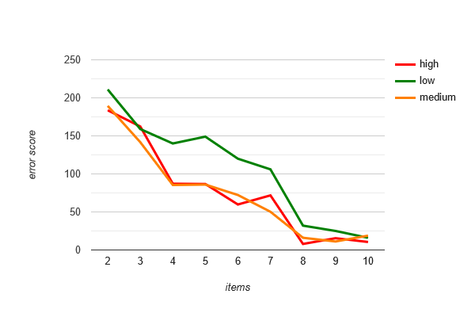

# NutritionAnalysis
analysing the nutrition data of common foods




```
C:\Users\Noah\Desktop\nutrition\NutritionAnalysis> python main.py 200000 10
391.16 grams Cornstarch
0.00 grams Nuts, pecans
2.76 grams Eggplant, raw
0.00 grams Teff, uncooked
175.61 grams Sherbet, orange
0.00 grams Cauliflower, raw
0.00 grams Taro leaves, raw
0.00 grams Lamb, raw, ground
0.00 grams Cheese, camembert
608.36 grams Vegetarian fillets
========================================================================
target calories: 3506, actual: 3508.1349673870745, difference: -2.134967387074539
target carbs: 468, actual: 465.31033016499816, difference: 2.689669835001837
target protein: 145, actual: 142.89937634828766, difference: 2.10062365171234
target fat: 117, actual: 113.41436594331653, difference: 3.5856340566834746
error score: 10.51089493047219
```

```
samples = 10000
210.8096078 159.0883317 139.8364306 149.4172354 119.6587223 105.8388581 32.20383124 24.90664459 16.200915
samples = 100000
189.504187 141.733502 85.45038948 85.97760984 72.27492595 50.22830953 16.04891025 11.15629236 18.85123788
samples = 200000
183.68754985149272 162.3710627373763 87.08737803344808 86.74516940167777 59.78822431224984 71.78271288503791 7.90938407825567 15.474200822727852 10.51089493047219
```
